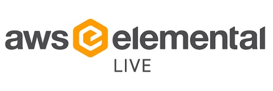

# AWS Elemental Live Tools

A collection of short and handy scripts for use with AWS Elemental Live on RHEL.

## Cleanup Old Videos
Removes files from the `/data/server/incoming/` directory older than 90 days. 

Copy the script to `/usr/local/bin`:

```bash
cp cleanup-old-videos.sh /usr/local/bin/
```

### Schedule to run weekly:

```bash
sudo nano /etc/crontab
```

Add the line:

```cron
#@weekly		elemental	/usr/local/bin/cleanup-old-videos.sh > /dev/null 2>&1
```

## SSL Fix
RHEL demands that the server is reached over HTTPS, and self-signed certificates are a nuissance. Use this script when you need to update the cert. 

Copy the script to `/usr/local/bin`:

```bash
cp ssl-fix /usr/local/bin/
hash -r
```

Invoke via the command line when needed with: `ssl-fix`

## DNF Autoupdate
Use this to keep all packages up to date. Safe to use as the AWS Elemental Live software pins dependencies.

Copy the script to `/usr/local/bin`:

```bash
cp dnf-autoupdate.sh /usr/local/bin/
```

### Schedule to run weekly:

```bash
sudo nano /etc/crontab
```

Add the line; in this example the script will run at 7:07 AM on Sunday:

```cron
7 7 * * sun	root		/usr/local/bin/dnf-autoupdate > /dev/null 2>&1
```